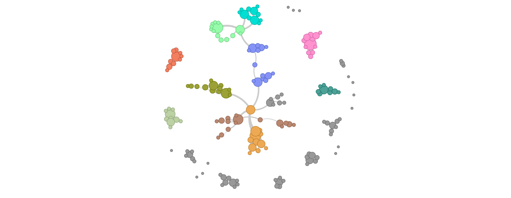

# METS-RCN-TimeSeries

## Google Sheet to Schema.org

* Google Sheet: https://docs.google.com/spreadsheets/d/1LRW-v2ZNbMuxLsRk-mTQ9cfUQh-70g82GllsYKzvHBc/edit
* Colab: https://colab.research.google.com/drive/1BqZrzK5OTl_iNpfChImHdlkCTnIizTYR?usp=sharing

The METS RCN recognizes the need to improve time series data discovery across data repositories and global search engines as a first critical step in elevating their overall FAIRness. Focusing on the socio-technical challenges of aggregating metadata across global time series stewards, the Bermuda workshop identified the use of the schema.org vocabulary as the most effective strategy to gather and publish machine-readable metadata with the broadest reach. Following guidelines at Science-on-Schema.org (Shepherd et al, 2024) and the Ocean InfoHub Project (Fils et al., 2024), participants arrived at a low-cost mechanism for describing time series metadata using a collaborative Google Sheets document. 

The document allows time series stewards to share metadata for the following concepts - Time Series Project, Cruises, Locations, Awards, People, Organizations, Datasets, Variables, and Data Files. Each concept is represented in the sheet as a single tab (or sheet). Each tab represents a class or concept in the Schema.org vocabulary and each column represents a Schema.org property associated with its respective class/concept. Importantly, every sheet has an identifier column where each cell in that column must be unique. Then, these identifiers are used in other sheets for corresponding properties that then link concepts to each other - Cruises to People, Datasets to Cruises, Variables to Datasets, Organizations to People, etc. 

A Python notebook was written to transform the Google Sheet into Schema.org data encoded as JSON-LD, a JSON-based Resource Description Framework (RDF) encoding. Because RDF encodes and encourages semantic links between its data elements, the Google Sheet, transformed into RDF, can generate a network graph that can be used to analyze communities and correlations in the data.

_A network diagram of the Time Series Google sheet as participants begin to link and reuse shared concepts in their own metadata with each other. This diagram shows correlations between Organizations and People as they are related across different time series._
